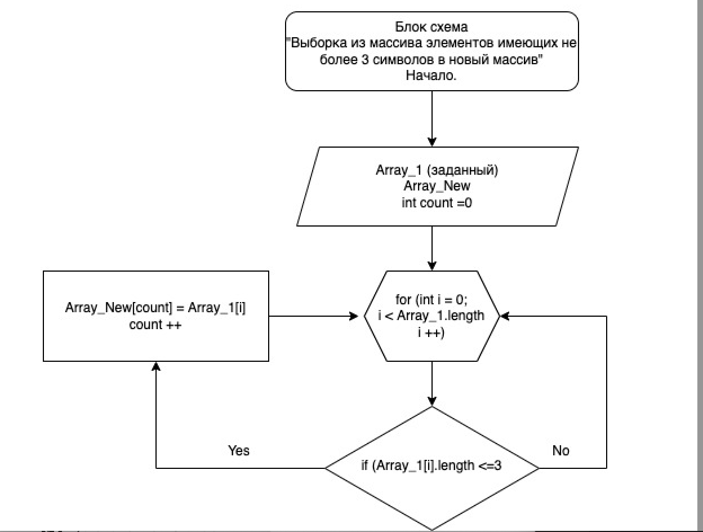

# Проверочная работа 1 блок обучения

Написать программу, которая из имеющегося массива строк формирует массив из строк, длина которых меньше либо равна 3 символа.
Первоначальный массив можно ввести с клавиатуры , либо задать на старте выполнения алгоритма.
При решении не рекомендуется пользоваться коллекциями, лучше обойтись исключительно массивами.

1. ["hello", "2", "world, ":-)"] -> ["2", ":-)"]

2. ["1234", "1567", "-2", "computer science"] -> ["-2"]

3. [“Russia”, “Denmark”, “Kazan”] → []

## Описание алгоритма решения

1. Создаем три одномерных массива, указанных в условии задачи;
2. Вводим переменную int MAX_WORD_LENGTH = 3 с заданной длиной символов;
3. Создаем новый массив Array_New (в программе - GetShortWordsArray(string[] array), в который будут отсортировываться элементы из заданных массивов, длина которых не превышает 3-х символов;
4. С помощью цикла "for" и счетчика "count" запускаем поочередную проверку элементов заданных массивов на соответствие условию задачи (length <=3 );
5. При выполнении условия элемент из заданного массива попадает в новый массив и выводится на экран;
6. После проверки всех элементов и вывода на экран программа останавливается.  

Графическое представление алгоритма для сортировки одного из заданных массивов в новый массив представлено в следующей блок-схеме:

